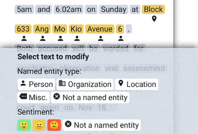
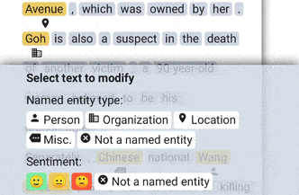
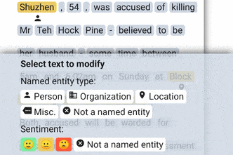
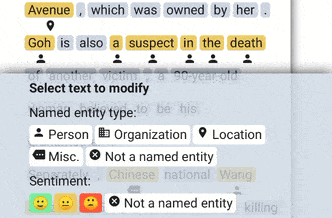
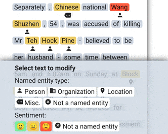
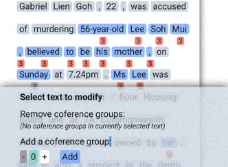
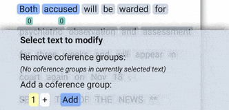

# NLP annotation tool

A side project that I completed on 9 Mar 2020. This mobile-friendly webapp makes it convenient to perform human annotation of documents for Natural Language Processing (NLP) tasks while on the go. This would provide more training data for NLP models to be further refined on. I just find it more engaging to be labelling training data using a touchscreen device rather than with a desktop computer, since I can conveniently continue to carry out my annotations while out and about and I find that I have some free time if I'm waiting in a queue or on the daily commute.

This was my first time trying out a Javascript framework instead of the vanilla Javascript web development that I am used to. I like how organized and modularized everything is in ReactJS, even though I was not familiar enough with it yet to have truly followed all of its principles throughout the course of project development.

### The NLP tasks covered in this version of the tool include:

- Named entity recognition

- Targeted sentiment classification:

- Coreference resolution:

- Topic classification:

